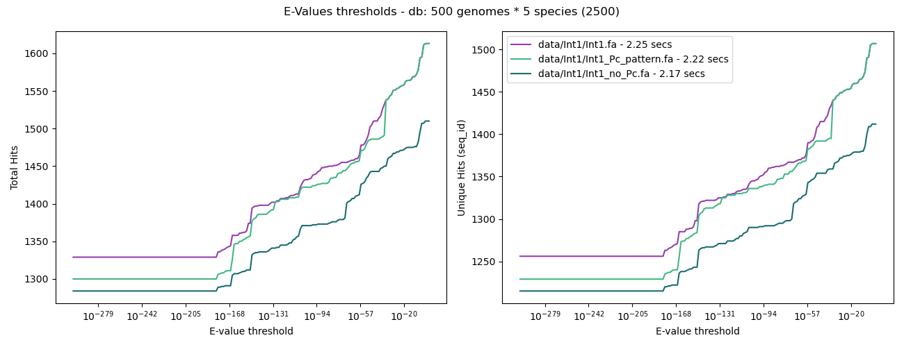

# Lunes 28/09

OBJETIVOS INCIALES:

- comentar bien lo de plotting y arreglar diagrama de venn para no superponer etiquetas

- ejectuar scripts sobre bbdd más grande -> 50 genomas each y sobre la de 1500

- ejecutar los scripts sobre una bbdd más grande (hecho con 50 genomas en total únicamnete, probar con 500 igual)

- empezar a hacer el pipeline completo pero emepzar por paralelizar la descarga.

## paralelizar

- Introducir lo hablado con Víctor:

    - subprocess.run() --> EJecuta tal cual y se para el script

    - a = subprocess.Popen() ---> Se ejecuta el process, pero se sigue ejecutando el script hasta la orden a.wait(), que lo espera

    - Buscar el número de cores del ordenador (argumento --max-workers en subprocess.run()) -> el tenía 32, y le daba 30 (--max-workers 30)

    - Buscar como hacer splits bien del archivo fetch que genera el dehydrated

    - Tras hacer la comparativa con la bbdd más pequeña, empezar a vincular procesos?

    - IMP: [**FIXME**]{style="color: red;"}: Comprobar con bacterias que no sean entero (ej ¿vibrio?) si es´ta tan conservada la Int

    - como rehydrate a veces da fallo, añadir intentos! (n_intentos hasta x)

He empezado a dividir el fetch file en el general y en SUCIO, mañana acabarlo

Dejo copiando al disco duro y mañana por la mañana ejectuar el script con 1500 genomas

# Martes 29/09

## Cosas a paralelizar

He dejado hecho el splitting del fetch para el rehydrate -> habría que adaptar bien los scripts con funciones útiles ect. para que esté bien organizado!

Empiezo a continuar la parte de blast en el script de general.py basandome en lo que tengo en el methods comparision

### Blastn

Tras la comparación con 500 genomas:

Que una query dé más hits no significa que sea mejor, ya que la más corta es la de no_Pc.
Y, al ser más corta, puntúa menos.
Además, las tres curvas suben en escalón conjuntamente, 
así que las diferencias pueden ser solo de longitud.

Por ahora voy a usar como query la de Pc_pattern, ya que la diferencia de tiempo es mínima y llega a los mismos hits que la normal

GHe dejado en general hecho todo el codigo incluyendo hasta la extracción del tipo de Pc

revisar bien el borrado bien de arhicvios y he dejado corrriendo el methdos comparision con 1500 genomas para mañana

> escribir mañana tmb crreo a modesto y jose