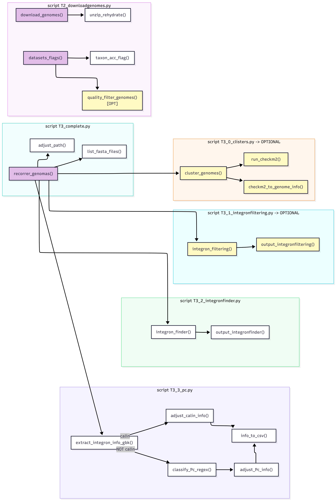

# Mermaid



```
---
config:
  layout: fixed
---
flowchart LR
 subgraph s1["script T2_downloadgenomes.py"]
        A["datasets_flags()"]
        B["taxon_acc_flag()"]
        C["quality_filter_genomes() [OPT]"]
        E["unzip_rehydrate()"]
        D["download_genomes()"]
  end
 subgraph s2["script T3_complete.py"]
        G["adjust_path()"]
        F["recorrer_genomas()"]
        H["list_fasta_files()"]
  end
 subgraph s3["script T3_0_clisters.py -> OPTIONAL"]
        I["cluster_genomes()"]
        J["run_checkm2()"]
        K["checkm2_to_genome_info()"]
  end
 subgraph s4["script T3_1_integronfiltering.py -&gt; OPTIONAL"]
        L["integron_filtering()"]
        M["output_integronfiltering()"]
  end
 subgraph s5["script T3_2_integronfinder.py"]
        N["integron_finder()"]
        O["output_integronfinder()"]
  end
 subgraph s6["script T3_3_pc.py"]
        P["extract_integron_info_gbk()"]
        Q["adjust_calin_info()"]
        R["classify_Pc_regex()"]
        S["adjust_Pc_info()"]
        T["info_to_csv()"]
  end
    A --> B & C
    D --> E
    F --> G & H & I & L & N & P
    I --> J & K
    L --> M
    N --> O
    P -- calin --> Q
    P -- NOT calin --> R
    R --> S
    Q --> T
    S --> T

    style A fill:#E1BEE7
    style C fill:#FFF9C4
    style D fill:#E1BEE7
    style F fill:#E1BEE7
    style I fill:#FFF9C4
    style J fill:#FFF9C4
    style K fill:#FFF9C4
    style L fill:#FFF9C4
    style M fill:#FFF9C4
```